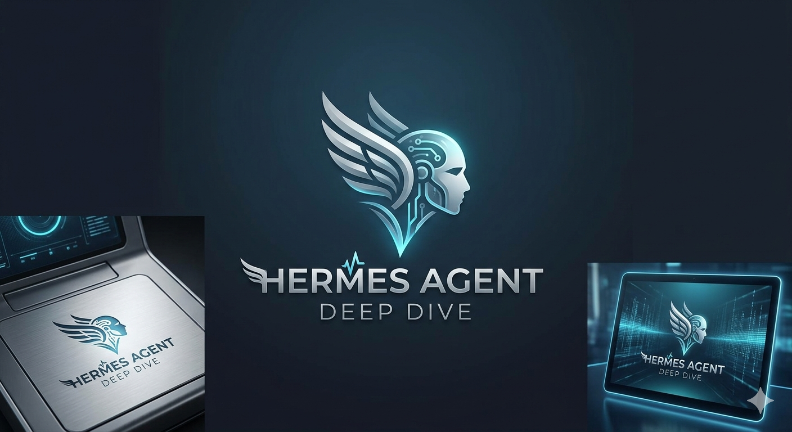

# Hermes Agent Deep Dive

> **20-chapter deep analysis series of a self-evolving AI agent** — every subsystem dissected, every module analyzed.

[](https://docsify.js.org/) []() []() []()

**Wiki**: [hermes_agent_deep_dive](https://smith-source.github.io/hermes_agent_deep_dive/)

---


## About

Hermes Agent is a self-evolving omniscient AI agent — creating skills from experience, continuously improving through usage, runnable in any environment. This project provides a **comprehensive 20-chapter deep dive** into its entire architecture, covering 347,240 lines of Python core and 91,223 lines of TypeScript frontend.

| Dimension | Scale |
|-----------|-------|
| Python Core | 347,240 lines |
| TypeScript Frontend | 91,223 lines |
| LLM Providers | 28+ |
| Messaging Platforms | 21+ |
| Self-Registering Tools | 29 (69 files) |
| Built-in Skills | 25 |
| Execution Backends | 7 |

---

## Chapter Overview

### Core Architecture & Subsystems (01–17)

| # | Title |
|---|-------|
| 01 | Project Overview & Design Philosophy |
| 02 | System Architecture |
| 03 | Core Agent Engine — AIAgent |
| 04 | LLM Provider System |
| 05 | Tool System |
| 06 | Gateway Messaging Platform |
| 07 | Frontend Interfaces |
| 08 | State & Persistence |
| 09 | Context & Memory Engine |
| 10 | Security System |
| 11 | Skills & Self-Evolution |
| 12 | Scheduled Tasks & Cron |
| 13 | RL Training Pipeline |
| 14 | Configuration System |
| 15 | Infrastructure & Deployment |
| 16 | Plugin System |
| 17 | Transferable Design Patterns |

### Supplementary Deep Analysis (18–20)

| # | Title |
|---|-------|
| 18 | Tool System Extended |
| 19 | Hermes CLI Subsystem |
| 20 | Agent Support Modules |

---

## Project Structure

```
hermes-agent-reviews/
├── docs/                   # Docsify documentation root
│   ├── index.html          # Docsify config (routing, search, plugins)
│   ├── README.md           # Landing page (hero, stats, reading paths)
│   ├── _navbar.md          # Top navigation (language switch)
│   ├── zh-CN/
│   │   ├── README.md       # Chinese homepage
│   │   └── chapters/       # 21 Chinese chapter files
│   └── en/
│       ├── README.md       # English homepage
│       └── chapters/       # 21 English chapter files
├── .gitignore
└── README.md               # This file
```

---

## Contributing

1. Fork this repository
2. Create your feature branch (`git checkout -b feature/your-chapter`)
3. Commit your changes
4. Push to the branch (`git push origin feature/your-chapter`)
5. Open a Pull Request

### Translation Guidelines

- Chinese files: `docs/zh-CN/chapters/XX-name.md`
- English files: `docs/en/chapters/XX-name.md`
- Navigation links use absolute Docsify paths:
  - Chinese: `/zh-CN/chapters/XX-name`
  - English: `/en/chapters/XX-name`

---

## License

[MIT](https://opensource.org/licenses/MIT)